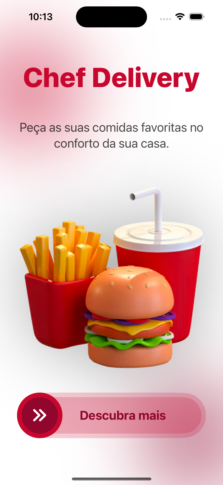
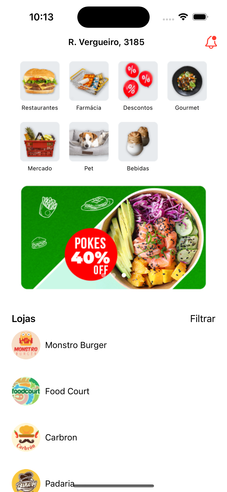
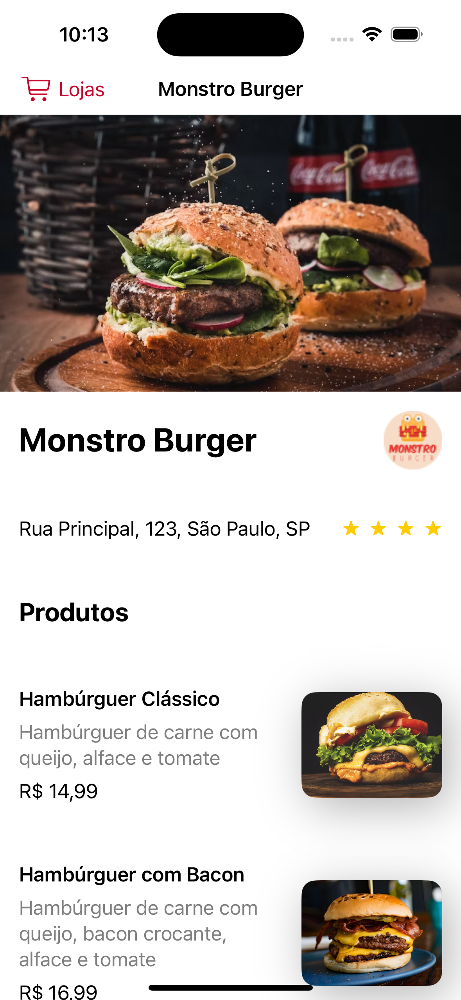
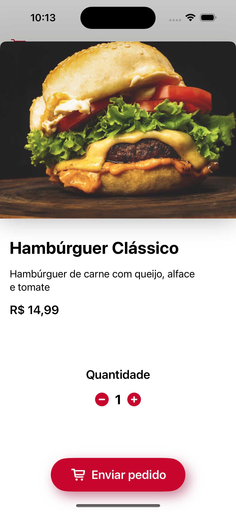

# ChefDelivery - Aplicativo iOS

A aplicação ChefDelivery é a simulação de um aplicativo de restaurantes para o sistema operacional iOS que utiliza a linguagem Swift e o framework SwiftUI.

 
    
    
    
    

## Recursos

- Listagem das categorias de restaurantes;
- Carrossel de imagens destacando os destaques do momento;
- Listagem de restaurantes;
- Exibição detalhada do restaurante, incluindo nome, imagem e informações adicionais;
- Listagem de produtos oferecidos pelo restaurante;
- Exibição detalhada do produto, incluindo nome, imagem, descrição e preço;
- Implementação de um menu de filtragem para selecionar a quantidade de estrelas desejada;
- Exibição dos restaurantes filtrados de acordo com a seleção feita pelo usuário;
- Animações para criar transições suaves nos componentes;
- Efeito de desfoque aplicado aos elementos da interface;
- Arraste e solte para interações de arrastar imagens;
- Animação de escala para aumentar e diminuir o tamanho dos elementos;
- Implementação de um botão customizado com efeito de deslizamento;
- Carrossel automático com transição entre os itens a cada 3 segundos;

## Técnicas e tecnologias

- SwiftUI: Framework moderno e declarativo da Apple para a criação de interfaces de usuário em aplicativos iOS;
- XCode: Ambiente de desenvolvimento integrado (IDE) oficial da Apple para desenvolvimento de aplicativos iOS;
- Swift: Linguagem de programação poderosa e intuitiva usada para desenvolver aplicativos iOS;
- ZStack: Componente que empilha os elementos em relação ao eixo Z, de profundidade, fazendo com que os elementos fiquem uns embaixo de outros;
- withAnimation: Função do SwiftUI utilizada para animar as mudanças de valores de uma variável de estado;
- GeometryReader: Recurso para obter informações sobre a geometria da tela;
- Timer: Utilização de temporizadores para automatizar o carrossel;
- DragGesture: Gesto que permite aos usuários interagirem com as visualizações por meio de movimentos de arrastar.

## Requisitos

- iOS 13.0 ou posterior.
- Xcode 12.0 ou posterior.
- Conexão à internet.

## Como Usar

1. Realize o download do projeto;
2. Descompacte o arquivo;
3. Abra o terminal dentro da pasta ChefDelivery;
4. Após a instalação das dependências, dê duplo clique no arquivo `ChefDelivery.xcodeproj`, que abrirá diretamente no XCode;
5. Com o projeto aberto no XCode, você consegue visualizar todas as pastas e arquivos;
6. Para rodar o seu projeto, você deve clicar no botão de play na parte superior do XCode. Você também pode alterar o simulador em que o aplicativo será exibido, e então, o projeto será aberto no simulador de sua preferência.

## Créditos

Este projeto foi desenvolvido com base nas aulas fornecidas no curso [Construa aplicativos iOS com SwiftUI](https://cursos.alura.com.br/formacao-ios-swiftui) da plataforma alura.

## Licença

Este aplicativo é distribuído sob a licença MIT.

---